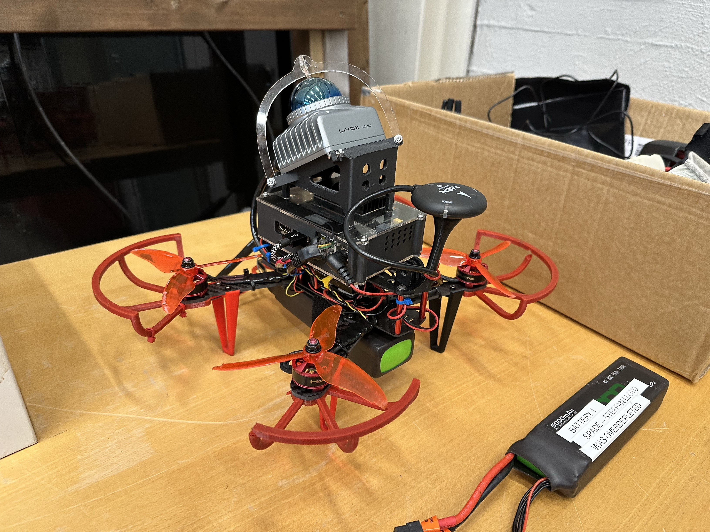
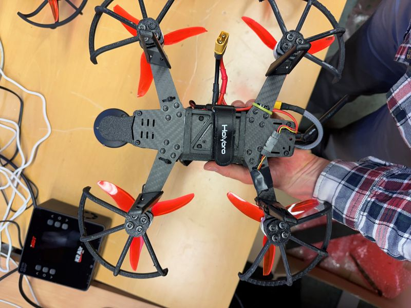
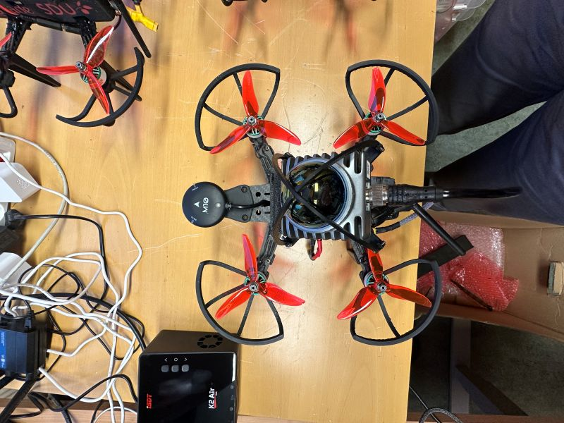
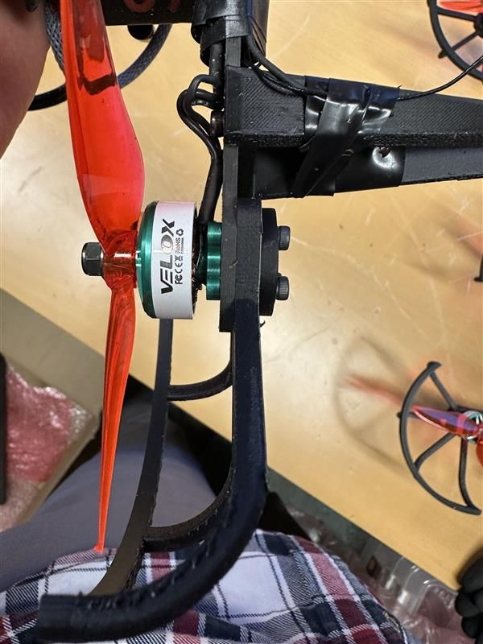
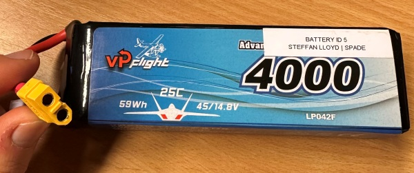

# Drone Setup

Here are some brief instructions to set up the drone, upon delivery.

## Reassemble drone
1. Connect legs. Legs are in the plastic bag with the screws. One leg goes on each wing as in the attached image.
2. Attach legs to bottom of drone. Note that half the legs are mirrored: Make sure the legs match the orientation shown in the image below. The bolts to use are in the bag with the legs. There are a few extra legs unless any break.
3. Connect the rotor guards. This is accomplished by unscrewing the 4x M3 bolts below each motor, then inserting the rotor guard between the bottom of the carbon fiber plate, and the round 3D printed plate. See the image below. Note half the guards are mirrored, ensure the guards are attached in the orientation shown.
4. Connect the rotors. Ensure the orientation is:

   

**Leg orientation:**

**Rotor guard orientation:**

**Rotor guard component stack:**

## Computer setup

Each drone has an onboard Raspberry Pi. When powered up, this Raspberry Pi will attempt to automatically connect to the included router, which creates the wifi network `RUT240_SL` (with password: `MPygGav752Fb9WAnQB84kK3=`).

To connect to the PC, first power it up. You may connect the included Raspberry Pi adapter, or connect a ~16 V power source (such as a 4S battery) to the main power terminals.

Then connect to the wifi network, and SSH into the device. Username is `spade`, password is `spade`.

Note that you cannot connect to the computer through the on-board Ethernet port: it is configured specifically to communicate with the LiDAR and cannot be used for networking. However, you can connect a USB-Ethernet adapter instead.

If any problems, contact Steffan Lloyd at steffan.lloyd@nibio.no.

## Alternative computer setup

If you can't establish an SSH connection, you can also connect a keyboard, mouse and screen directly to the computer. Then, open up a terminal and type the same commands as above until a wifi connection is established. Note that a mini-HDMI to HDMI adapter is included in the box that has been filed down to fit into the small opening in the Raspberry Pi case.

## Drone batteries

You will need to use/purchase your own drone batteries. Use 4000 mAh, 4S batteries. They should have an XT60 connector (depending on availability, you may need to get a battery with a different connector, then use an adapter). 5000 mAh batteries can also work, although the drone will not be as maneuverable. You should get 5-6 minutes of battery life with this setup.

A sample battery is:

## Remotes and telemetry

The telemetry modules and remotes are included. Each is labelled as "1", "2", or "3" depending on which swarm drone it is paired with.

